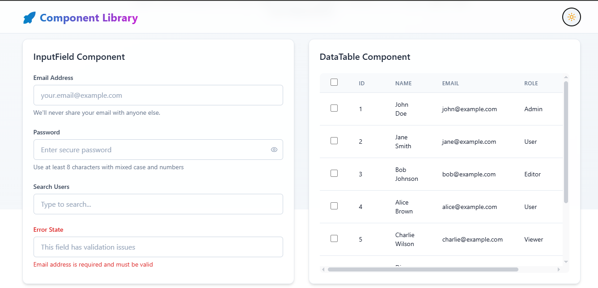
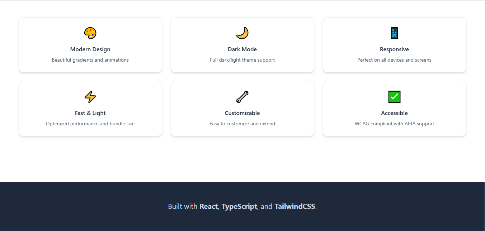
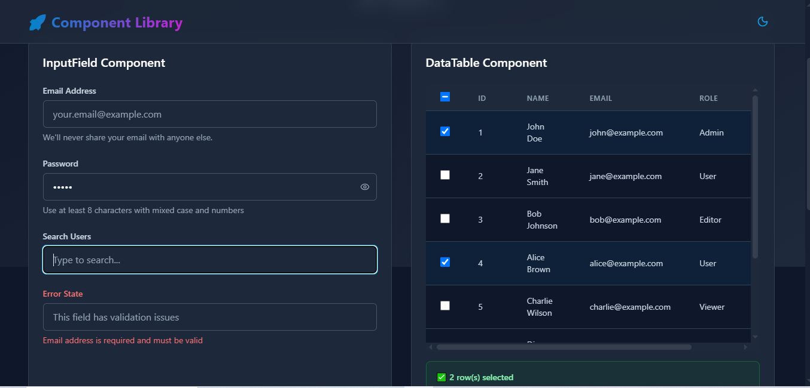
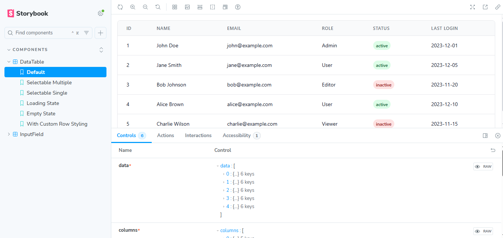
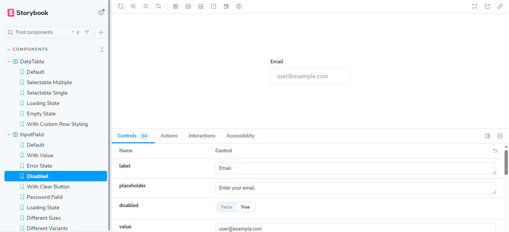
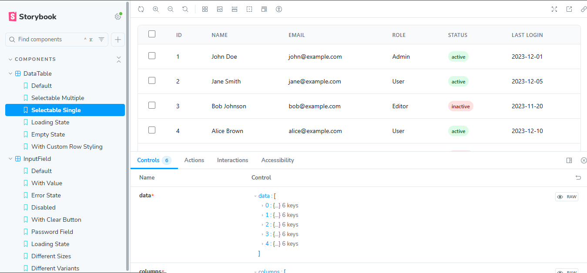
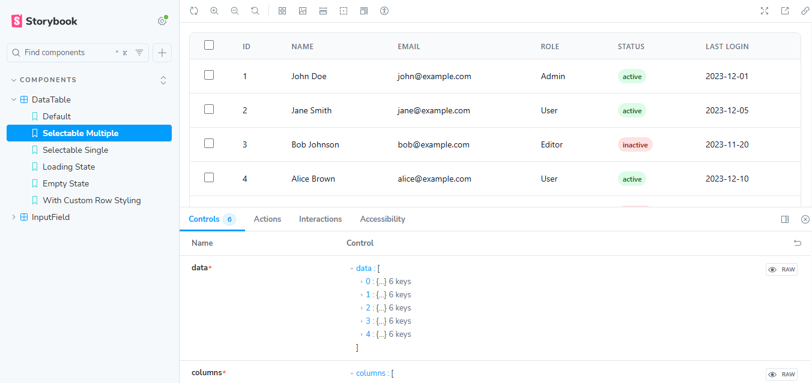

# Frontend Assignment - InputField Component

This project is a **Storybook-based frontend assignment** that
demonstrates the implementation of an **InputField UI component** using
React, TypeScript, and TailwindCSS.









## 🚀 Tech Stack

-   **React** (UI framework)
-   **TypeScript** (type safety)
-   **TailwindCSS** (utility-first styling)
-   **Storybook** (UI development & documentation)

## 📂 Project Structure

    ├── src/
    │   ├── components/
    │   │   └── InputField/
    │   │       ├── InputField.tsx       # InputField component
    │   │       ├── InputField.stories.tsx # Storybook stories
    │   │       └── InputField.test.tsx  # Unit tests (if included)
    │   ├── styles/                       # Global styles & Tailwind config
    │   └── App.tsx                       # Root application file
    ├── .storybook/                       # Storybook configuration
    ├── package.json                      # Dependencies & scripts
    └── tailwind.config.js                # Tailwind configuration

## ⚡ Features

-   Clean **InputField component**
-   Responsive design with TailwindCSS
-   **Dark mode support**
-   Accessible scrollbar with styled UI
-   Footer text: `"Built with React, TypeScript, and TailwindCSS"`

## 🛠️ Installation & Setup

Clone the repository and install dependencies:

``` bash
git clone <repo-url>
cd <repo-folder>
npm install
```

Run Storybook:

``` bash
npm run storybook
```

Run the React App:

``` bash
npm start
```

# Live Demo

Open [this link](https://68ac2a236df1122d8b26167a--react-component-library-typescript.netlify.app/) to view the live Storybook demo of the React component library.

---

## 🎨 UI Enhancements

-   Custom **scrollbar styling** with hover effect
-   Adjusted **text size & line-height** for better readability
-   **Footer properly aligned** and always accessible across devices

## 📌 Notes

-   If the scrollbar does not reach the footer, ensure `min-h-screen`
    and `flex flex-col` layouts are applied to the root container.
-   This ensures content pushes the footer down correctly on all
    devices.

------------------------------------------------------------------------

✅ **Final Footer Text:**\
`Built with React, TypeScript, and TailwindCSS`
